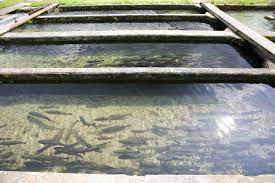
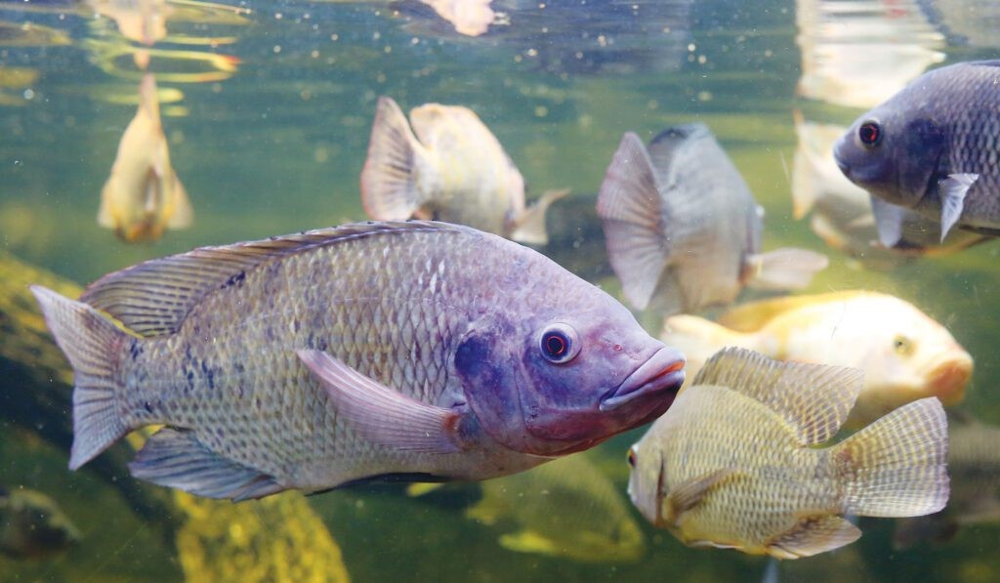

### Lewish_Fish_Farm
 

## Introduction

Fish farming in Nigeria is a growing industry that can help address food security challenges and protein deficits. Despite high demand, domestic production has been limited, leading to imports. However, with abundant water resources, a favorable climate, and government support, fish farming now offers opportunities for business growth, job creation, and improved food security. This analysis covered the period of 2021-2022

## Statement 

The Objectives of this analysis is to calculate.
- Total number of Sales in the period

- Total number number of Orders

- State by Orders

- Profit by State

- Product by Revenue

- Product by qunatity Ordered

- Monthly Sales

 ## Skills Demostrated

 The following skills are demostrated

  - Excel for data profiling
    
  - Pivorttable for KPIs
    
  - Silcers for filtering
    
  - Excel for data visualization

  - ## Data Sourcing
  - 

This datasets is from www.kaggle.com. it is a excel file with a single table. Its has 10 columns and 1351 rows.

## Data Transformation 

The is a clean data with very few null values with were filtered out.

## Data Analysis and Visualization 

- Total Revenue is 8,973,929 milion during the period covered.

- Total Profit is 5282383.55

- Total Orders is 1350

- Abuja tops the highest states by profit with 1.14m

- Rivers Orders the most with 272 orders

- Bullhead has the top quantity ordered with 33%

## Conclusion And Recommendations

Develop modern fish farms with adequate water supply, drainage, and aeration systems.

 Offer workshops and training programs for fish farmers on best practices, disease management, and marketing strategies.

Establish local feed mills to produce high-quality fish feed, reducing reliance on imports.

Encourage environmentally friendly farming methods, such as recirculating aquaculture systems (RAS) and integrated multi-trophic aquaculture (IMTA).

Offer loans, grants, and subsidies to fish farmers, especially small-scale operators, to support expansion and modernization.

Establish robust market channels, both domestic and international, to ensure stable demand and competitive pricing.

Establish a national disease surveillance system and implement effective disease management strategies.

Foster partnerships between researchers, farmers, and industry stakeholders to develop innovative solutions and improve productivity.

Develop and enforce policies that support sustainable fish farming practices, protect the environment, and ensure food safety.

Encourage the development of value-added products, such as smoked, dried, or processed fish, to increase profitability and competitiveness.

