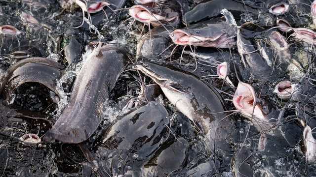
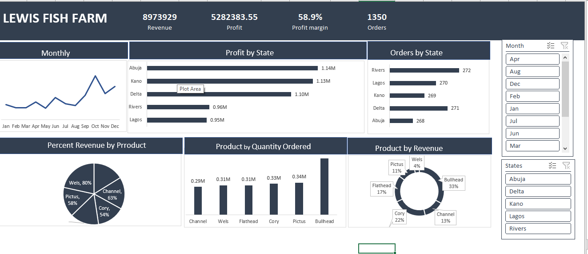

### Lewish_Fish_Farm
 

## Introduction

Fish farming in Nigeria is a growing industry that can help address food security challenges and protein deficits. Despite high demand, domestic production has been limited, leading to imports. However, with abundant water resources, a favorable climate, and government support, fish farming now offers opportunities for business growth, job creation, and improved food security. This analysis covered the period of 2021-2022

## Statement 

The Objectives of this analysis is to calculate.
- Total number of Sales in the period

- Total number number of Orders

- State by Orders

- Profit by State

- Product by Revenue

- Product by qunatity Ordered

- Monthly Sales

 ## Skills Demostrated

 The following skills are demostrated

  - Excel for data profiling
    
  - Pivorttable for KPIs
    
  - Silcers for filtering
    
  - Excel for data visualization

  - ## Data Sourcing
  - 
